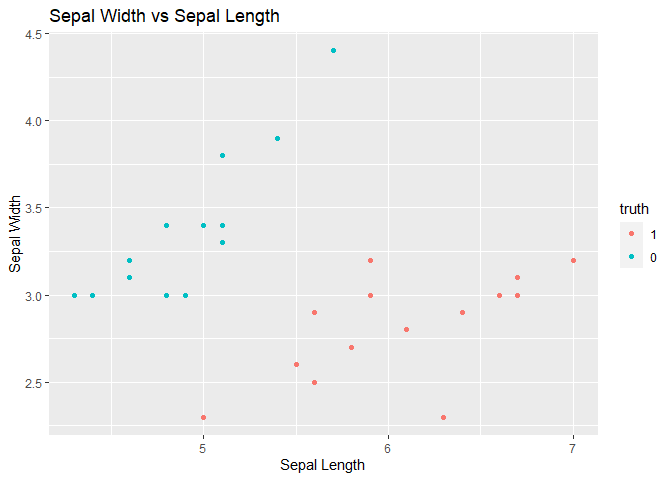
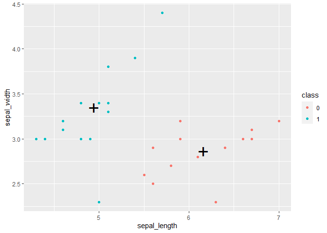
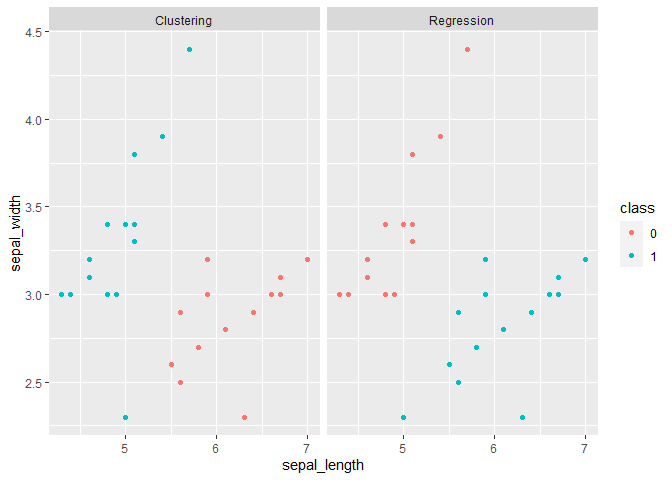
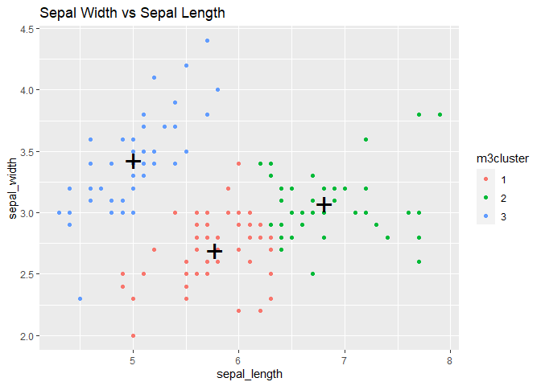
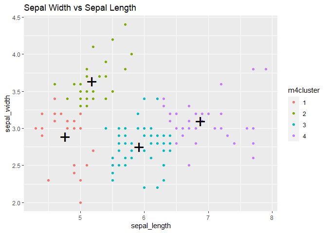
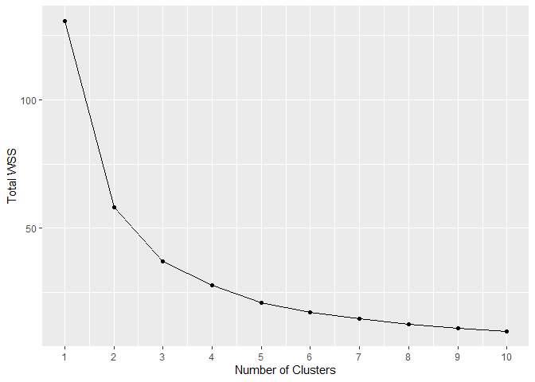
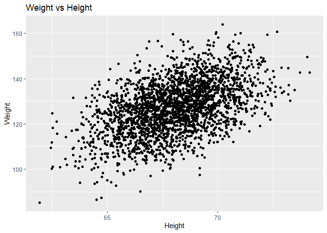
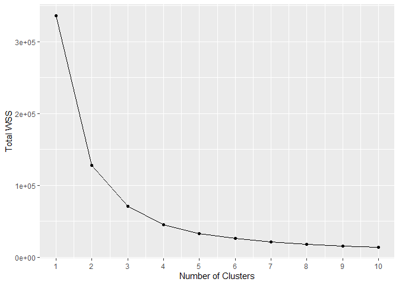
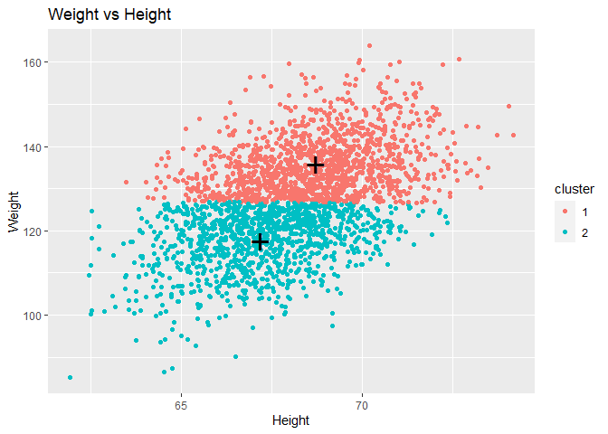
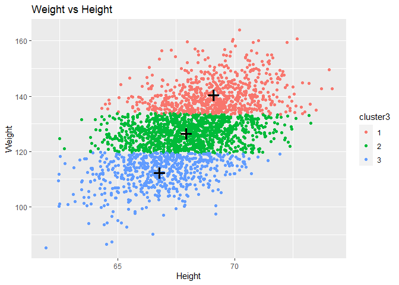

Clustering
================
2023-04-03

## Iris Clustering

``` r
library(tidyverse)
```

    ## ── Attaching core tidyverse packages ──────────────────────── tidyverse 2.0.0 ──
    ## ✔ dplyr     1.1.0     ✔ readr     2.1.4
    ## ✔ forcats   1.0.0     ✔ stringr   1.5.0
    ## ✔ ggplot2   3.4.1     ✔ tibble    3.1.8
    ## ✔ lubridate 1.9.2     ✔ tidyr     1.3.0
    ## ✔ purrr     1.0.1     
    ## ── Conflicts ────────────────────────────────────────── tidyverse_conflicts() ──
    ## ✖ dplyr::filter() masks stats::filter()
    ## ✖ dplyr::lag()    masks stats::lag()
    ## ℹ Use the ]8;;http://conflicted.r-lib.org/conflicted package]8;; to force all conflicts to become errors

``` r
library(tidymodels)
```

    ## Warning: package 'tidymodels' was built under R version 4.2.3

    ## ── Attaching packages ────────────────────────────────────── tidymodels 1.0.0 ──
    ## ✔ broom        1.0.3     ✔ rsample      1.1.1
    ## ✔ dials        1.2.0     ✔ tune         1.0.1
    ## ✔ infer        1.0.4     ✔ workflows    1.1.3
    ## ✔ modeldata    1.1.0     ✔ workflowsets 1.0.0
    ## ✔ parsnip      1.0.4     ✔ yardstick    1.1.0
    ## ✔ recipes      1.0.5

    ## Warning: package 'infer' was built under R version 4.2.3

    ## Warning: package 'modeldata' was built under R version 4.2.3

    ## Warning: package 'parsnip' was built under R version 4.2.3

    ## Warning: package 'rsample' was built under R version 4.2.3

    ## Warning: package 'tune' was built under R version 4.2.3

    ## Warning: package 'workflows' was built under R version 4.2.3

    ## Warning: package 'workflowsets' was built under R version 4.2.3

    ## Warning: package 'yardstick' was built under R version 4.2.3

    ## ── Conflicts ───────────────────────────────────────── tidymodels_conflicts() ──
    ## ✖ scales::discard() masks purrr::discard()
    ## ✖ dplyr::filter()   masks stats::filter()
    ## ✖ recipes::fixed()  masks stringr::fixed()
    ## ✖ dplyr::lag()      masks stats::lag()
    ## ✖ yardstick::spec() masks readr::spec()
    ## ✖ recipes::step()   masks stats::step()
    ## • Learn how to get started at https://www.tidymodels.org/start/

``` r
library(janitor)
```

    ## 
    ## Attaching package: 'janitor'
    ## 
    ## The following objects are masked from 'package:stats':
    ## 
    ##     chisq.test, fisher.test

## Loading the data set

``` r
data <- iris %>% clean_names()
head(data)
```

    ##   sepal_length sepal_width petal_length petal_width species
    ## 1          5.1         3.5          1.4         0.2  setosa
    ## 2          4.9         3.0          1.4         0.2  setosa
    ## 3          4.7         3.2          1.3         0.2  setosa
    ## 4          4.6         3.1          1.5         0.2  setosa
    ## 5          5.0         3.6          1.4         0.2  setosa
    ## 6          5.4         3.9          1.7         0.4  setosa

Let’s see which types of species of irises there are.

``` r
unique(data$species)
```

    ## [1] setosa     versicolor virginica 
    ## Levels: setosa versicolor virginica

We are going to do a binary classification, so let’s only keep two of
the species and set ‘setosa’ rows to 1 and the other to 0

``` r
dat <- data %>% 
  filter(species != "virginica") %>% 
  mutate(species_int = ifelse(species == "setosa", 0,1)) %>% 
  select(sepal_length, sepal_width, species, species_int)
```

## Supervised vs Unsupervised Learning

Let’s compare using a method we already know to our new clustering
method to determine which species the irises are.

Before we do that. Let’s create a test and training set.

``` r
inds <- sample(1:nrow(dat),size = round(nrow(dat)*.7),replace = F)
train <- dat %>% slice(inds)
test <- dat %>% slice(-inds)
```

Now we will use a regression to determine the species!

### Supervised Learning - Classification (Logistic Regression)

Here, we are only going to use sepal length and width to determine
species.

``` r
mLG <- glm(factor(species) ~ sepal_length + sepal_width, #formula. Determining species with                                                            sepal length and width  
           family = binomial(link = 'logit'), #Using a logit
           data = train) #training the model with the 'train' dataset

reg_test <- test %>% 
  mutate(proba = predict(mLG, newdata = test, type = "response"), #Predicting the values of                                                                    the 'test' dataset with our                                                                   trained model
         pred = ifelse(proba > 0.5,1,0), #Making a binary prediction
         truth = factor(species_int,levels = c('1','0'))) %>%
  select(species, sepal_length, sepal_width, prob=proba, pred, truth) #select and reorder                                                                          columns for clarity 

reg_test
```

    ##       species sepal_length sepal_width         prob pred truth
    ## 1      setosa          4.9         3.0 2.220446e-16    0     0
    ## 2      setosa          4.6         3.1 2.220446e-16    0     0
    ## 3      setosa          5.4         3.9 2.220446e-16    0     0
    ## 4      setosa          5.0         3.4 2.220446e-16    0     0
    ## 5      setosa          4.8         3.4 2.220446e-16    0     0
    ## 6      setosa          4.8         3.0 2.220446e-16    0     0
    ## 7      setosa          4.3         3.0 2.220446e-16    0     0
    ## 8      setosa          5.7         4.4 2.220446e-16    0     0
    ## 9      setosa          5.4         3.9 2.220446e-16    0     0
    ## 10     setosa          5.1         3.8 2.220446e-16    0     0
    ## 11     setosa          5.1         3.3 2.220446e-16    0     0
    ## 12     setosa          4.4         3.0 2.220446e-16    0     0
    ## 13     setosa          5.1         3.4 2.220446e-16    0     0
    ## 14     setosa          4.8         3.0 2.220446e-16    0     0
    ## 15     setosa          5.1         3.8 2.220446e-16    0     0
    ## 16     setosa          4.6         3.2 2.220446e-16    0     0
    ## 17 versicolor          7.0         3.2 1.000000e+00    1     1
    ## 18 versicolor          5.9         3.0 1.000000e+00    1     1
    ## 19 versicolor          5.6         2.9 1.000000e+00    1     1
    ## 20 versicolor          5.8         2.7 1.000000e+00    1     1
    ## 21 versicolor          5.6         2.5 1.000000e+00    1     1
    ## 22 versicolor          5.9         3.2 1.000000e+00    1     1
    ## 23 versicolor          6.1         2.8 1.000000e+00    1     1
    ## 24 versicolor          6.4         2.9 1.000000e+00    1     1
    ## 25 versicolor          6.6         3.0 1.000000e+00    1     1
    ## 26 versicolor          6.7         3.0 1.000000e+00    1     1
    ## 27 versicolor          6.7         3.1 1.000000e+00    1     1
    ## 28 versicolor          6.3         2.3 1.000000e+00    1     1
    ## 29 versicolor          5.5         2.6 1.000000e+00    1     1
    ## 30 versicolor          5.0         2.3 1.000000e+00    1     1

``` r
table(reg_test$truth, reg_test$pred) #Confusion matrix!!!
```

    ##    
    ##      0  1
    ##   1  0 14
    ##   0 16  0

``` r
roc_auc(reg_test,truth = 'truth',estimate = 'pred')
```

    ## # A tibble: 1 × 3
    ##   .metric .estimator .estimate
    ##   <chr>   <chr>          <dbl>
    ## 1 roc_auc binary             1

As we can see in the chunk above, the model fits very well.

``` r
ggplot(reg_test) +
  geom_point(aes(x = sepal_length, y = sepal_width, color = truth)) +
  labs(title = "Sepal Width vs Sepal Length", x = "Sepal Length", y = "Sepal Width")
```

<!-- --> Graph
of our classification from regression.

Now, let’s try our new clustering method!

### Unsupervised Learning - Clustering (K-Means Clustering)

So lets try and compare if our kmeans clustering method would classify
the points differently than regression.

To do this we are simply going to create clusters of our ‘test’ dataset
with the kmeans algorithm, and see if those clusters are the same as how
the regression classified the points.

``` r
clust_test <- test %>% 
  select(-species, truth=species_int) %>% #UNSUPERVISED LEARNING!!!
  mutate(method = "Clustering")
clust_test
```

    ##    sepal_length sepal_width truth     method
    ## 1           4.9         3.0     0 Clustering
    ## 2           4.6         3.1     0 Clustering
    ## 3           5.4         3.9     0 Clustering
    ## 4           5.0         3.4     0 Clustering
    ## 5           4.8         3.4     0 Clustering
    ## 6           4.8         3.0     0 Clustering
    ## 7           4.3         3.0     0 Clustering
    ## 8           5.7         4.4     0 Clustering
    ## 9           5.4         3.9     0 Clustering
    ## 10          5.1         3.8     0 Clustering
    ## 11          5.1         3.3     0 Clustering
    ## 12          4.4         3.0     0 Clustering
    ## 13          5.1         3.4     0 Clustering
    ## 14          4.8         3.0     0 Clustering
    ## 15          5.1         3.8     0 Clustering
    ## 16          4.6         3.2     0 Clustering
    ## 17          7.0         3.2     1 Clustering
    ## 18          5.9         3.0     1 Clustering
    ## 19          5.6         2.9     1 Clustering
    ## 20          5.8         2.7     1 Clustering
    ## 21          5.6         2.5     1 Clustering
    ## 22          5.9         3.2     1 Clustering
    ## 23          6.1         2.8     1 Clustering
    ## 24          6.4         2.9     1 Clustering
    ## 25          6.6         3.0     1 Clustering
    ## 26          6.7         3.0     1 Clustering
    ## 27          6.7         3.1     1 Clustering
    ## 28          6.3         2.3     1 Clustering
    ## 29          5.5         2.6     1 Clustering
    ## 30          5.0         2.3     1 Clustering

- `x` is the data (only select the columns of interest!)

- `centers` is the number of centroids

- `iter.max` maximum amount of “steps”

- `nstart` how many times to re-estimate

### With 2 clusters

*Remember:* in supervised learning (regression), we train the model by
knowing the actual value for each row and finding how the features
determine that. With unsupervised learning (clustering), we are simply
learning about the data without knowing the actual values. This is why
we remove the ‘truth’ column in the chunk below.

``` r
set.seed(123)
m2 <- kmeans(clust_test%>%select(-method, -truth), centers = 2, nstart = 10) #train.
m2
```

    ## K-means clustering with 2 clusters of sizes 13, 17
    ## 
    ## Cluster means:
    ##   sepal_length sepal_width
    ## 1     6.161538    2.861538
    ## 2     4.947059    3.347059
    ## 
    ## Clustering vector:
    ##  [1] 2 2 2 2 2 2 2 2 2 2 2 2 2 2 2 2 1 1 1 1 1 1 1 1 1 1 1 1 1 2
    ## 
    ## Within cluster sum of squares by cluster:
    ## [1] 3.781538 6.024706
    ##  (between_SS / total_SS =  56.2 %)
    ## 
    ## Available components:
    ## 
    ## [1] "cluster"      "centers"      "totss"        "withinss"     "tot.withinss"
    ## [6] "betweenss"    "size"         "iter"         "ifault"

Let’s visualize our clusters!

``` r
clust_test$class = factor(m2$cluster-1)
clust_test
```

    ##    sepal_length sepal_width truth     method class
    ## 1           4.9         3.0     0 Clustering     1
    ## 2           4.6         3.1     0 Clustering     1
    ## 3           5.4         3.9     0 Clustering     1
    ## 4           5.0         3.4     0 Clustering     1
    ## 5           4.8         3.4     0 Clustering     1
    ## 6           4.8         3.0     0 Clustering     1
    ## 7           4.3         3.0     0 Clustering     1
    ## 8           5.7         4.4     0 Clustering     1
    ## 9           5.4         3.9     0 Clustering     1
    ## 10          5.1         3.8     0 Clustering     1
    ## 11          5.1         3.3     0 Clustering     1
    ## 12          4.4         3.0     0 Clustering     1
    ## 13          5.1         3.4     0 Clustering     1
    ## 14          4.8         3.0     0 Clustering     1
    ## 15          5.1         3.8     0 Clustering     1
    ## 16          4.6         3.2     0 Clustering     1
    ## 17          7.0         3.2     1 Clustering     0
    ## 18          5.9         3.0     1 Clustering     0
    ## 19          5.6         2.9     1 Clustering     0
    ## 20          5.8         2.7     1 Clustering     0
    ## 21          5.6         2.5     1 Clustering     0
    ## 22          5.9         3.2     1 Clustering     0
    ## 23          6.1         2.8     1 Clustering     0
    ## 24          6.4         2.9     1 Clustering     0
    ## 25          6.6         3.0     1 Clustering     0
    ## 26          6.7         3.0     1 Clustering     0
    ## 27          6.7         3.1     1 Clustering     0
    ## 28          6.3         2.3     1 Clustering     0
    ## 29          5.5         2.6     1 Clustering     0
    ## 30          5.0         2.3     1 Clustering     1

``` r
clust_test %>%
  ggplot(aes(x = sepal_length, y = sepal_width, color=class)) +
  geom_point() +
  geom_point(data=data.frame(m2$centers),
             aes(x=sepal_length, y=sepal_width),
             inherit.aes = F, shape = '+',size = 10)
```

<!-- -->

``` r
  labs(title = "Sepal Width vs Sepal Length")
```

    ## $title
    ## [1] "Sepal Width vs Sepal Length"
    ## 
    ## attr(,"class")
    ## [1] "labels"

Evaluate the fit with the withinss value.

``` r
sum(tidy(m2)$withinss)
```

    ## [1] 9.806244

Now, let’s compare these classifications to the regression predictions.

``` r
facet_reg_test = reg_test %>%
  select(sepal_length, sepal_width, class=pred) %>%
  mutate(method="Regression", class=factor(class))

comparison = bind_rows(facet_reg_test, clust_test)

comparison %>%
  ggplot(aes(x=sepal_length, y=sepal_width, color=class)) +
  geom_point() +
  facet_wrap(~method)
```

<!-- --> As we
can see, these are not exactly the same result. The clustering method
classified the several of the points in the middle and bottom left
differently from the regression method.

Let’s see the confusion matrix for the clusters.

``` r
table(clust_test$truth, clust_test$class) #Confusion matrix!!!
```

    ##    
    ##      0  1
    ##   0  0 16
    ##   1 13  1

Looking at the CM for the regression model:

``` r
table(reg_test$truth, reg_test$pred) #Confusion matrix!!!
```

    ##    
    ##      0  1
    ##   1  0 14
    ##   0 16  0

*IN CONCLUSION:* We can see that clustering did slightly worse. That
being said, let’s remember clustering never saw the labels for any of
the data. It simply learned from the test set and algorithmically put
the points in groups. This is un

Now that we can see the clusters, let’s predict our test set and see if
kmeans, classifies the points the same way the regression did.

HOPEFULLY THAT WAS HELPFUL IN BETTER EXPLAINING CLUSTERING WHICH IS AN
UNSUPERVISED LEARNING METHOD.

Now, let’s remember that initially, our first dataset had three types of
flowers. So let’s reuse that dataset and see how kmeans classify those.

### With 3 clusters

``` r
data
```

    ##     sepal_length sepal_width petal_length petal_width    species
    ## 1            5.1         3.5          1.4         0.2     setosa
    ## 2            4.9         3.0          1.4         0.2     setosa
    ## 3            4.7         3.2          1.3         0.2     setosa
    ## 4            4.6         3.1          1.5         0.2     setosa
    ## 5            5.0         3.6          1.4         0.2     setosa
    ## 6            5.4         3.9          1.7         0.4     setosa
    ## 7            4.6         3.4          1.4         0.3     setosa
    ## 8            5.0         3.4          1.5         0.2     setosa
    ## 9            4.4         2.9          1.4         0.2     setosa
    ## 10           4.9         3.1          1.5         0.1     setosa
    ## 11           5.4         3.7          1.5         0.2     setosa
    ## 12           4.8         3.4          1.6         0.2     setosa
    ## 13           4.8         3.0          1.4         0.1     setosa
    ## 14           4.3         3.0          1.1         0.1     setosa
    ## 15           5.8         4.0          1.2         0.2     setosa
    ## 16           5.7         4.4          1.5         0.4     setosa
    ## 17           5.4         3.9          1.3         0.4     setosa
    ## 18           5.1         3.5          1.4         0.3     setosa
    ## 19           5.7         3.8          1.7         0.3     setosa
    ## 20           5.1         3.8          1.5         0.3     setosa
    ## 21           5.4         3.4          1.7         0.2     setosa
    ## 22           5.1         3.7          1.5         0.4     setosa
    ## 23           4.6         3.6          1.0         0.2     setosa
    ## 24           5.1         3.3          1.7         0.5     setosa
    ## 25           4.8         3.4          1.9         0.2     setosa
    ## 26           5.0         3.0          1.6         0.2     setosa
    ## 27           5.0         3.4          1.6         0.4     setosa
    ## 28           5.2         3.5          1.5         0.2     setosa
    ## 29           5.2         3.4          1.4         0.2     setosa
    ## 30           4.7         3.2          1.6         0.2     setosa
    ## 31           4.8         3.1          1.6         0.2     setosa
    ## 32           5.4         3.4          1.5         0.4     setosa
    ## 33           5.2         4.1          1.5         0.1     setosa
    ## 34           5.5         4.2          1.4         0.2     setosa
    ## 35           4.9         3.1          1.5         0.2     setosa
    ## 36           5.0         3.2          1.2         0.2     setosa
    ## 37           5.5         3.5          1.3         0.2     setosa
    ## 38           4.9         3.6          1.4         0.1     setosa
    ## 39           4.4         3.0          1.3         0.2     setosa
    ## 40           5.1         3.4          1.5         0.2     setosa
    ## 41           5.0         3.5          1.3         0.3     setosa
    ## 42           4.5         2.3          1.3         0.3     setosa
    ## 43           4.4         3.2          1.3         0.2     setosa
    ## 44           5.0         3.5          1.6         0.6     setosa
    ## 45           5.1         3.8          1.9         0.4     setosa
    ## 46           4.8         3.0          1.4         0.3     setosa
    ## 47           5.1         3.8          1.6         0.2     setosa
    ## 48           4.6         3.2          1.4         0.2     setosa
    ## 49           5.3         3.7          1.5         0.2     setosa
    ## 50           5.0         3.3          1.4         0.2     setosa
    ## 51           7.0         3.2          4.7         1.4 versicolor
    ## 52           6.4         3.2          4.5         1.5 versicolor
    ## 53           6.9         3.1          4.9         1.5 versicolor
    ## 54           5.5         2.3          4.0         1.3 versicolor
    ## 55           6.5         2.8          4.6         1.5 versicolor
    ## 56           5.7         2.8          4.5         1.3 versicolor
    ## 57           6.3         3.3          4.7         1.6 versicolor
    ## 58           4.9         2.4          3.3         1.0 versicolor
    ## 59           6.6         2.9          4.6         1.3 versicolor
    ## 60           5.2         2.7          3.9         1.4 versicolor
    ## 61           5.0         2.0          3.5         1.0 versicolor
    ## 62           5.9         3.0          4.2         1.5 versicolor
    ## 63           6.0         2.2          4.0         1.0 versicolor
    ## 64           6.1         2.9          4.7         1.4 versicolor
    ## 65           5.6         2.9          3.6         1.3 versicolor
    ## 66           6.7         3.1          4.4         1.4 versicolor
    ## 67           5.6         3.0          4.5         1.5 versicolor
    ## 68           5.8         2.7          4.1         1.0 versicolor
    ## 69           6.2         2.2          4.5         1.5 versicolor
    ## 70           5.6         2.5          3.9         1.1 versicolor
    ## 71           5.9         3.2          4.8         1.8 versicolor
    ## 72           6.1         2.8          4.0         1.3 versicolor
    ## 73           6.3         2.5          4.9         1.5 versicolor
    ## 74           6.1         2.8          4.7         1.2 versicolor
    ## 75           6.4         2.9          4.3         1.3 versicolor
    ## 76           6.6         3.0          4.4         1.4 versicolor
    ## 77           6.8         2.8          4.8         1.4 versicolor
    ## 78           6.7         3.0          5.0         1.7 versicolor
    ## 79           6.0         2.9          4.5         1.5 versicolor
    ## 80           5.7         2.6          3.5         1.0 versicolor
    ## 81           5.5         2.4          3.8         1.1 versicolor
    ## 82           5.5         2.4          3.7         1.0 versicolor
    ## 83           5.8         2.7          3.9         1.2 versicolor
    ## 84           6.0         2.7          5.1         1.6 versicolor
    ## 85           5.4         3.0          4.5         1.5 versicolor
    ## 86           6.0         3.4          4.5         1.6 versicolor
    ## 87           6.7         3.1          4.7         1.5 versicolor
    ## 88           6.3         2.3          4.4         1.3 versicolor
    ## 89           5.6         3.0          4.1         1.3 versicolor
    ## 90           5.5         2.5          4.0         1.3 versicolor
    ## 91           5.5         2.6          4.4         1.2 versicolor
    ## 92           6.1         3.0          4.6         1.4 versicolor
    ## 93           5.8         2.6          4.0         1.2 versicolor
    ## 94           5.0         2.3          3.3         1.0 versicolor
    ## 95           5.6         2.7          4.2         1.3 versicolor
    ## 96           5.7         3.0          4.2         1.2 versicolor
    ## 97           5.7         2.9          4.2         1.3 versicolor
    ## 98           6.2         2.9          4.3         1.3 versicolor
    ## 99           5.1         2.5          3.0         1.1 versicolor
    ## 100          5.7         2.8          4.1         1.3 versicolor
    ## 101          6.3         3.3          6.0         2.5  virginica
    ## 102          5.8         2.7          5.1         1.9  virginica
    ## 103          7.1         3.0          5.9         2.1  virginica
    ## 104          6.3         2.9          5.6         1.8  virginica
    ## 105          6.5         3.0          5.8         2.2  virginica
    ## 106          7.6         3.0          6.6         2.1  virginica
    ## 107          4.9         2.5          4.5         1.7  virginica
    ## 108          7.3         2.9          6.3         1.8  virginica
    ## 109          6.7         2.5          5.8         1.8  virginica
    ## 110          7.2         3.6          6.1         2.5  virginica
    ## 111          6.5         3.2          5.1         2.0  virginica
    ## 112          6.4         2.7          5.3         1.9  virginica
    ## 113          6.8         3.0          5.5         2.1  virginica
    ## 114          5.7         2.5          5.0         2.0  virginica
    ## 115          5.8         2.8          5.1         2.4  virginica
    ## 116          6.4         3.2          5.3         2.3  virginica
    ## 117          6.5         3.0          5.5         1.8  virginica
    ## 118          7.7         3.8          6.7         2.2  virginica
    ## 119          7.7         2.6          6.9         2.3  virginica
    ## 120          6.0         2.2          5.0         1.5  virginica
    ## 121          6.9         3.2          5.7         2.3  virginica
    ## 122          5.6         2.8          4.9         2.0  virginica
    ## 123          7.7         2.8          6.7         2.0  virginica
    ## 124          6.3         2.7          4.9         1.8  virginica
    ## 125          6.7         3.3          5.7         2.1  virginica
    ## 126          7.2         3.2          6.0         1.8  virginica
    ## 127          6.2         2.8          4.8         1.8  virginica
    ## 128          6.1         3.0          4.9         1.8  virginica
    ## 129          6.4         2.8          5.6         2.1  virginica
    ## 130          7.2         3.0          5.8         1.6  virginica
    ## 131          7.4         2.8          6.1         1.9  virginica
    ## 132          7.9         3.8          6.4         2.0  virginica
    ## 133          6.4         2.8          5.6         2.2  virginica
    ## 134          6.3         2.8          5.1         1.5  virginica
    ## 135          6.1         2.6          5.6         1.4  virginica
    ## 136          7.7         3.0          6.1         2.3  virginica
    ## 137          6.3         3.4          5.6         2.4  virginica
    ## 138          6.4         3.1          5.5         1.8  virginica
    ## 139          6.0         3.0          4.8         1.8  virginica
    ## 140          6.9         3.1          5.4         2.1  virginica
    ## 141          6.7         3.1          5.6         2.4  virginica
    ## 142          6.9         3.1          5.1         2.3  virginica
    ## 143          5.8         2.7          5.1         1.9  virginica
    ## 144          6.8         3.2          5.9         2.3  virginica
    ## 145          6.7         3.3          5.7         2.5  virginica
    ## 146          6.7         3.0          5.2         2.3  virginica
    ## 147          6.3         2.5          5.0         1.9  virginica
    ## 148          6.5         3.0          5.2         2.0  virginica
    ## 149          6.2         3.4          5.4         2.3  virginica
    ## 150          5.9         3.0          5.1         1.8  virginica

``` r
datClust = data %>%
  select(species, sepal_length, sepal_width) %>%
  mutate(truth = ifelse(species=="setosa", 1,
                        ifelse(species=="versicolor", 2, 3)))
m3 <- kmeans(datClust%>%select(-species, -truth), centers = 3,nstart = 10)
m3
```

    ## K-means clustering with 3 clusters of sizes 53, 47, 50
    ## 
    ## Cluster means:
    ##   sepal_length sepal_width
    ## 1     5.773585    2.692453
    ## 2     6.812766    3.074468
    ## 3     5.006000    3.428000
    ## 
    ## Clustering vector:
    ##   [1] 3 3 3 3 3 3 3 3 3 3 3 3 3 3 3 3 3 3 3 3 3 3 3 3 3 3 3 3 3 3 3 3 3 3 3 3 3
    ##  [38] 3 3 3 3 3 3 3 3 3 3 3 3 3 2 2 2 1 2 1 2 1 2 1 1 1 1 1 1 2 1 1 1 1 1 1 1 1
    ##  [75] 2 2 2 2 1 1 1 1 1 1 1 1 2 1 1 1 1 1 1 1 1 1 1 1 1 1 2 1 2 2 2 2 1 2 2 2 2
    ## [112] 2 2 1 1 2 2 2 2 1 2 1 2 1 2 2 1 1 2 2 2 2 2 1 1 2 2 2 1 2 2 2 1 2 2 2 1 2
    ## [149] 2 1
    ## 
    ## Within cluster sum of squares by cluster:
    ## [1] 11.3000 12.6217 13.1290
    ##  (between_SS / total_SS =  71.6 %)
    ## 
    ## Available components:
    ## 
    ## [1] "cluster"      "centers"      "totss"        "withinss"     "tot.withinss"
    ## [6] "betweenss"    "size"         "iter"         "ifault"

``` r
datClust <- datClust %>% 
  mutate(m3cluster = factor(m3$cluster))

cents3 <- data.frame(m3$centers)

ggplot(datClust) +
  geom_point(aes(x = sepal_length, y = sepal_width, color = m3cluster)) +
  geom_point(data = cents3, aes(x = sepal_length,y = sepal_width),
             inherit.aes = F,shape = '+',size = 10) +
  labs(title = "Sepal Width vs Sepal Length")
```

<!-- -->

``` r
tidy(m3)
```

    ## # A tibble: 3 × 5
    ##   sepal_length sepal_width  size withinss cluster
    ##          <dbl>       <dbl> <int>    <dbl> <fct>  
    ## 1         5.77        2.69    53     11.3 1      
    ## 2         6.81        3.07    47     12.6 2      
    ## 3         5.01        3.43    50     13.1 3

``` r
sum(tidy(m3)$withinss)
```

    ## [1] 37.0507

Let’s see how it did.

``` r
table(datClust$truth, datClust$m3cluster)
```

    ##    
    ##      1  2  3
    ##   1  0  0 50
    ##   2 38 12  0
    ##   3 15 35  0

It appears the kmeans did a pretty good job!

Finally, lets see how kmeans, would classify these flowers into 4
clusters, even though we know there are only 3 clusters. \### With 4
clusters

``` r
datClust = data %>%
  select(species, sepal_length, sepal_width) %>%
  mutate(truth = ifelse(species=="setosa", 1,
                        ifelse(species=="versicolor", 2, 3)))

m4 <- kmeans(datClust%>%select(-species, -truth), centers = 4,nstart = 10)
m4
```

    ## K-means clustering with 4 clusters of sizes 24, 32, 53, 41
    ## 
    ## Cluster means:
    ##   sepal_length sepal_width
    ## 1     4.766667    2.891667
    ## 2     5.187500    3.637500
    ## 3     5.924528    2.750943
    ## 4     6.880488    3.097561
    ## 
    ## Clustering vector:
    ##   [1] 2 1 1 1 2 2 1 2 1 1 2 2 1 1 2 2 2 2 2 2 2 2 2 2 2 1 2 2 2 1 1 2 2 2 1 1 2
    ##  [38] 2 1 2 2 1 1 2 2 1 2 1 2 2 4 4 4 3 4 3 4 1 4 1 1 3 3 3 3 4 3 3 3 3 3 3 3 3
    ##  [75] 3 4 4 4 3 3 3 3 3 3 3 3 4 3 3 3 3 3 3 1 3 3 3 3 1 3 4 3 4 3 4 4 1 4 4 4 4
    ## [112] 3 4 3 3 4 4 4 4 3 4 3 4 3 4 4 3 3 3 4 4 4 3 3 3 4 4 4 3 4 4 4 3 4 4 4 3 4
    ## [149] 3 3
    ## 
    ## Within cluster sum of squares by cluster:
    ## [1]  4.451667  4.630000  8.250566 10.634146
    ##  (between_SS / total_SS =  78.6 %)
    ## 
    ## Available components:
    ## 
    ## [1] "cluster"      "centers"      "totss"        "withinss"     "tot.withinss"
    ## [6] "betweenss"    "size"         "iter"         "ifault"

``` r
datClust <- datClust %>% 
  mutate(m4cluster = factor(m4$cluster))

cents4 <- data.frame(m4$centers)

ggplot(datClust) +
  geom_point(aes(x = sepal_length, y = sepal_width, color = m4cluster)) +
  geom_point(data = cents4, aes(x = sepal_length,y = sepal_width),
             inherit.aes = F,shape = '+',size = 10) +
  labs(title = "Sepal Width vs Sepal Length")
```

<!-- -->

``` r
tidy(m4)
```

    ## # A tibble: 4 × 5
    ##   sepal_length sepal_width  size withinss cluster
    ##          <dbl>       <dbl> <int>    <dbl> <fct>  
    ## 1         4.77        2.89    24     4.45 1      
    ## 2         5.19        3.64    32     4.63 2      
    ## 3         5.92        2.75    53     8.25 3      
    ## 4         6.88        3.10    41    10.6  4

``` r
sum(tidy(m4)$withinss)
```

    ## [1] 27.96638

``` r
datClust = data %>%
  select(species, sepal_length, sepal_width) %>%
  mutate(truth = ifelse(species=="setosa", 1,
                        ifelse(species=="versicolor", 2, 3)))
totWSS <- NULL
for(k in 1:10) {
  m.cluster <- datClust %>% select(contains("sepal")) %>% kmeans(centers = k,nstart = 10)
  totWSS <- data.frame(totWSS = m.cluster$tot.withinss,k = k) %>%
    bind_rows(totWSS)
}
```

#### Choosing the right “ELBOW”

``` r
totWSS %>%
  ggplot(aes(x = k,y = totWSS)) + 
  geom_line() + geom_point() + 
  labs(x = 'Number of Clusters',y = 'Total WSS') + 
  scale_x_continuous(breaks = 1:10)
```

<!-- -->

### Now let’s practice using our method on a new batch of data

### New Data

``` r
hw <- read_csv("https://raw.githubusercontent.com/MUbarak123-56/DataBEL/master/SOCR-HeightWeight.csv") %>%  clean_names()
```

    ## Rows: 25000 Columns: 3
    ## ── Column specification ────────────────────────────────────────────────────────
    ## Delimiter: ","
    ## dbl (3): Index, Height(Inches), Weight(Pounds)
    ## 
    ## ℹ Use `spec()` to retrieve the full column specification for this data.
    ## ℹ Specify the column types or set `show_col_types = FALSE` to quiet this message.

``` r
glimpse(hw)
```

    ## Rows: 25,000
    ## Columns: 3
    ## $ index         <dbl> 1, 2, 3, 4, 5, 6, 7, 8, 9, 10, 11, 12, 13, 14, 15, 16, 1…
    ## $ height_inches <dbl> 65.78331, 71.51521, 69.39874, 68.21660, 67.78781, 68.697…
    ## $ weight_pounds <dbl> 112.99250, 136.48730, 153.02690, 142.33540, 144.29710, 1…

``` r
head(hw)
```

    ## # A tibble: 6 × 3
    ##   index height_inches weight_pounds
    ##   <dbl>         <dbl>         <dbl>
    ## 1     1          65.8          113.
    ## 2     2          71.5          136.
    ## 3     3          69.4          153.
    ## 4     4          68.2          142.
    ## 5     5          67.8          144.
    ## 6     6          68.7          123.

``` r
inds <- sample(1:nrow(hw),size = round(nrow(hw)*.1),replace = F)
hw_new <- hw %>% slice(inds)
```

``` r
ggplot(hw_new) +
  geom_point(aes(x = height_inches, y= weight_pounds)) +
  labs(title = "Weight vs Height", x = "Height", y = "Weight")
```

<!-- -->

``` r
totWSS <- NULL
for(k in 1:10) {
  m.cluster <- hw_new %>% select(height_inches, weight_pounds) %>%  kmeans(centers = k,nstart = 10)
  totWSS <- data.frame(totWSS = m.cluster$tot.withinss,k = k) %>%
    bind_rows(totWSS)
}
```

``` r
totWSS %>%
  ggplot(aes(x = k,y = totWSS)) + 
  geom_line() + geom_point() + 
  labs(x = 'Number of Clusters',y = 'Total WSS') + 
  scale_x_continuous(breaks = 1:10)
```

<!-- -->

``` r
m2 <- kmeans(hw_new %>%  select(height_inches, weight_pounds), centers = 2)
tidy(m2)
```

    ## # A tibble: 2 × 5
    ##   height_inches weight_pounds  size withinss cluster
    ##           <dbl>         <dbl> <int>    <dbl> <fct>  
    ## 1          68.7          136.  1317   66582. 1      
    ## 2          67.2          118.  1183   61128. 2

``` r
hw_new <- hw_new %>% 
  mutate(cluster = factor(m2$cluster))

cents <- data.frame(m2$centers)

ggplot(hw_new) + 
  geom_point(aes(x = height_inches, y = weight_pounds, color = cluster)) +
  geom_point(data = cents, aes(x = height_inches,y = weight_pounds),
             inherit.aes = F,shape = '+',size = 10) +
  labs(title = "Weight vs Height", x = "Height", y = "Weight") 
```

<!-- -->

``` r
m3 <- kmeans(hw_new %>%  select(height_inches, weight_pounds), centers = 3)
tidy(m3)
```

    ## # A tibble: 3 × 5
    ##   height_inches weight_pounds  size withinss cluster
    ##           <dbl>         <dbl> <int>    <dbl> <fct>  
    ## 1          69.1          141.   725   26277. 1      
    ## 2          67.9          127.  1163   22096. 2      
    ## 3          66.8          112.   612   22808. 3

``` r
hw_new <- hw_new %>% 
  mutate(cluster3 = factor(m3$cluster))

cents <- data.frame(m3$centers)

ggplot(hw_new) + 
  geom_point(aes(x = height_inches, y = weight_pounds, color = cluster3)) +
  geom_point(data = cents, aes(x = height_inches,y = weight_pounds),
             inherit.aes = F,shape = '+',size = 10) +
  labs(title = "Weight vs Height", x = "Height", y = "Weight")
```

<!-- -->
